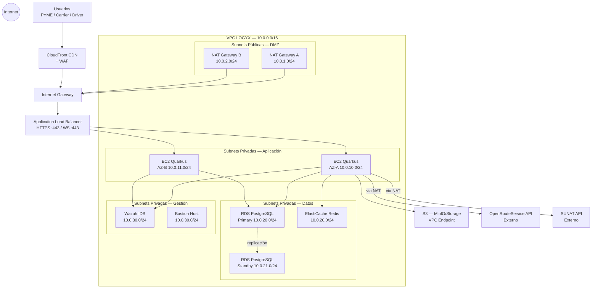
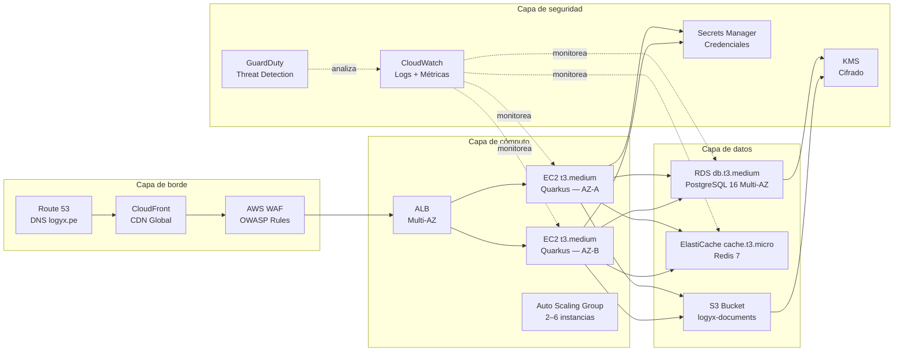

# S1 · Entregable 1 — Diseño de Red
> Competencia C1.1 · Diseño de infraestructura de conectividad  
> Proyecto: LOGYX — Sistema Operativo Logístico Colaborativo para PYMEs  
> Equipo: Jorge Gutiérrez Miranda · Fabrizio Sanchez Saravia · Alex Coila Jarita  
> Semestre 1 · Junio 2026

---

## Resumen Ejecutivo

LOGYX es una plataforma SaaS logística B2B que conecta PYMEs y transportistas en el corredor Lima–Arequipa–Juliaca. Su infraestructura de red se implementa íntegramente en **Amazon Web Services (AWS)**, región **sa-east-1 (São Paulo)**, la más cercana al Perú con baja latencia (~120 ms desde Lima).

El diseño adopta una arquitectura de red **multi-capa y multi-AZ** (dos zonas de disponibilidad), equivalente a una topología de red empresarial con DMZ, segmentación por VLAN y redundancia de enlaces. Ningún componente crítico tiene un único punto de falla. La red soporta hasta 500 usuarios concurrentes en la fase MVP y escala horizontalmente sin rediseño.

---

## Sección 1 — Levantamiento de Requerimientos

### 1.1 Requerimientos Técnicos

| ID | Requerimiento | Valor objetivo | Justificación |
|----|--------------|----------------|---------------|
| RT-01 | Latencia API desde Lima | < 120 ms | RNF-01: tiempo de respuesta < 2s. La latencia de red debe ser < 6% del presupuesto total. |
| RT-02 | Ancho de banda saliente (pico) | ≥ 100 Mbps | Carga de fotos de entrega (avg 2 MB × 200 entregas/hora en pico) + tráfico API |
| RT-03 | Usuarios concurrentes MVP | 500 | Estimado de 200 PYMEs + 200 carriers + 100 drivers activos simultáneamente |
| RT-04 | Disponibilidad de red | ≥ 99.9% | SLA AWS VPC + Multi-AZ cubre este objetivo |
| RT-05 | Aislamiento de entornos | Producción / Staging / Dev separados | Evitar que bugs de dev afecten datos de producción |
| RT-06 | Acceso a servicios externos | SUNAT (HTTPS), ORS API (HTTPS), Google OAuth (HTTPS) | Solo salida HTTPS/443 desde subnets privadas vía NAT Gateway |
| RT-07 | Tráfico WebSocket | Persistente, < 200 ms | Chat de negociación en tiempo real. Requiere sticky sessions en ALB. |
| RT-08 | Seguridad perimetral | WAF + Security Groups + NACLs | Bloqueo de OWASP Top 10, DDoS básico |

### 1.2 Requerimientos de Negocio

| ID | Requerimiento | Impacto en red |
|----|--------------|----------------|
| RN-01 | Alta disponibilidad del marketplace | Pérdida de conectividad = pérdida de ofertas → afecta ingresos directamente |
| RN-02 | Crecimiento esperado ×5 en 12 meses | Arquitectura debe escalar sin rediseño de red |
| RN-03 | Apps móviles en zonas rurales (sierra) | API debe responder con payloads ligeros; Driver app funciona offline |
| RN-04 | Separación de ambientes | Datos de clientes reales nunca en staging/dev |
| RN-05 | Costos operativos controlados | Usar NAT Gateway compartido; CloudFront para reducir tráfico de salida |
| RN-06 | Cumplimiento de privacidad | Tráfico de datos personales (RUC, DNI) solo en subnets privadas |

---

## Sección 2 — Diseño de Topología

### 2.1 Visión General de la Arquitectura de Red

LOGYX utiliza una **Virtual Private Cloud (VPC)** en AWS como equivalente a una red empresarial privada. La VPC se divide en capas que corresponden a las zonas de una red tradicional:

| Zona tradicional | Equivalente AWS en LOGYX |
|-----------------|--------------------------|
| Internet (exterior) | Internet Gateway (IGW) + CloudFront |
| DMZ | Subnets públicas + WAF + Application Load Balancer |
| Red interna (servidores) | Subnets privadas — capa de aplicación |
| Red de datos (BD) | Subnets privadas — capa de datos |
| Segmentación VLAN | Security Groups + NACLs por subnet |

### 2.2 Diseño de VPC

```
Región: sa-east-1 (São Paulo)
VPC CIDR: 10.0.0.0/16 (65,534 hosts disponibles)

┌─────────────────────────────────────────────────────────────────────┐
│  VPC LOGYX — 10.0.0.0/16                                           │
│                                                                     │
│  ┌──────────────────────────────┐  ┌──────────────────────────┐   │
│  │  AZ-A (sa-east-1a)           │  │  AZ-B (sa-east-1b)       │   │
│  │                              │  │                          │   │
│  │  [Subnet pública-A]          │  │  [Subnet pública-B]      │   │
│  │  10.0.1.0/24                 │  │  10.0.2.0/24             │   │
│  │  • ALB (listener 80/443)     │  │  • ALB (failover)        │   │
│  │  • NAT Gateway               │  │  • NAT Gateway           │   │
│  │                              │  │                          │   │
│  │  [Subnet privada App-A]      │  │  [Subnet privada App-B]  │   │
│  │  10.0.10.0/24                │  │  10.0.11.0/24            │   │
│  │  • EC2 Quarkus backend       │  │  • EC2 Quarkus backend   │   │
│  │  • ECS tasks (Fargate)       │  │  • ECS tasks (Fargate)   │   │
│  │                              │  │                          │   │
│  │  [Subnet privada Datos-A]    │  │  [Subnet privada Datos-B]│   │
│  │  10.0.20.0/24                │  │  10.0.21.0/24            │   │
│  │  • RDS PostgreSQL (primary)  │  │  • RDS PostgreSQL (standby)  │
│  │  • ElastiCache Redis (primary)│ │  • ElastiCache (replica) │   │
│  │                              │  │                          │   │
│  │  [Subnet privada Mgmt-A]     │  │  [Subnet privada Mgmt-B] │   │
│  │  10.0.30.0/24                │  │  10.0.31.0/24            │   │
│  │  • Wazuh IDS server          │  │  —                       │   │
│  │  • Bastion Host              │  │  —                       │   │
│  └──────────────────────────────┘  └──────────────────────────┘   │
│                                                                     │
│  [Subnet aislada — Security Testing]                               │
│  10.0.99.0/24                                                       │
│  • Kali Linux EC2 (ataques controlados — solo S2)                  │
│  • Sin routing a subnets de producción                             │
└─────────────────────────────────────────────────────────────────────┘
```

### 2.3 Tabla de Subnetting Completo

| Subnet | CIDR | AZ | Tipo | Propósito | Hosts disponibles |
|--------|------|----|------|-----------|-------------------|
| logyx-public-a | 10.0.1.0/24 | sa-east-1a | Pública | ALB, NAT Gateway | 251 |
| logyx-public-b | 10.0.2.0/24 | sa-east-1b | Pública | ALB failover, NAT GW | 251 |
| logyx-app-a | 10.0.10.0/24 | sa-east-1a | Privada | EC2 Quarkus, ECS Fargate | 251 |
| logyx-app-b | 10.0.11.0/24 | sa-east-1b | Privada | EC2 Quarkus, ECS Fargate | 251 |
| logyx-data-a | 10.0.20.0/24 | sa-east-1a | Privada | RDS Primary, Redis Primary | 251 |
| logyx-data-b | 10.0.21.0/24 | sa-east-1b | Privada | RDS Standby, Redis Replica | 251 |
| logyx-mgmt-a | 10.0.30.0/24 | sa-east-1a | Privada | Wazuh, Bastion Host | 251 |
| logyx-mgmt-b | 10.0.31.0/24 | sa-east-1b | Privada | Reservado | 251 |
| logyx-security-test | 10.0.99.0/24 | sa-east-1a | Aislada | Kali Linux (pruebas S2) | 251 |

### 2.4 Topología Lógica



### 2.5 Topología Física (Recursos AWS)



### 2.6 Segmentación por Security Groups (equivalente a VLANs)

| Security Group | Tráfico entrante permitido | Tráfico saliente permitido | Asociado a |
|----------------|---------------------------|---------------------------|------------|
| `sg-alb` | HTTPS 443 desde 0.0.0.0/0 | 8080 hacia `sg-backend` | ALB |
| `sg-backend` | 8080 desde `sg-alb`; 22 desde `sg-bastion` | 5432 → `sg-rds`; 6379 → `sg-redis`; 443 → Internet (NAT) | EC2 Quarkus |
| `sg-rds` | 5432 desde `sg-backend` | Ninguno | RDS PostgreSQL |
| `sg-redis` | 6379 desde `sg-backend` | Ninguno | ElastiCache Redis |
| `sg-wazuh` | 1514, 1515, 55000 desde `sg-backend`; 443 desde `sg-bastion` | 443 → Internet (logs) | Wazuh IDS |
| `sg-bastion` | 22 desde IP fija del equipo | 22 → `sg-backend`; 443 → `sg-wazuh` | Bastion Host |
| `sg-security-test` | Sin ingreso externo | Solo hacia 10.0.99.0/24 (aislada) | Kali Linux |

### 2.7 Network ACLs (NACLs) — Control perimetral adicional

| NACL | Subnet | Regla | Acción |
|------|--------|-------|--------|
| `nacl-public` | Subnets públicas | Entrada: 443 desde 0.0.0.0/0; Salida: todo | ALLOW |
| `nacl-public` | Subnets públicas | Entrada: todo lo demás | DENY |
| `nacl-private-app` | 10.0.10.0/24, 10.0.11.0/24 | Entrada: solo desde 10.0.1.0/24, 10.0.2.0/24 | ALLOW |
| `nacl-private-data` | 10.0.20.0/24, 10.0.21.0/24 | Entrada: solo desde 10.0.10.0/24, 10.0.11.0/24 | ALLOW |
| `nacl-mgmt` | 10.0.30.0/24 | Entrada: solo desde 10.0.10.0/24, 10.0.11.0/24, IP fija | ALLOW |
| `nacl-security-test` | 10.0.99.0/24 | Sin acceso a subnets de producción | DENY |

### 2.8 Tablas de Enrutamiento

| Tabla de rutas | Destino | Target | Aplica a |
|---------------|---------|--------|---------|
| `rt-public` | 0.0.0.0/0 | Internet Gateway | Subnets públicas |
| `rt-public` | 10.0.0.0/16 | local | Subnets públicas |
| `rt-private-a` | 0.0.0.0/0 | NAT Gateway A | Subnets privadas AZ-A |
| `rt-private-a` | 10.0.0.0/16 | local | Subnets privadas AZ-A |
| `rt-private-b` | 0.0.0.0/0 | NAT Gateway B | Subnets privadas AZ-B |
| `rt-private-b` | 10.0.0.0/16 | local | Subnets privadas AZ-B |
| `rt-data` | 10.0.0.0/16 | local | Subnets de datos (sin salida a internet) |
| `rt-security-test` | 10.0.99.0/24 | local | Subnet aislada (sin rutas externas) |

**VPC Endpoints (tráfico privado sin pasar por Internet):**
- `S3 Gateway Endpoint` → evita cargos de NAT para tráfico S3
- `SSM Interface Endpoint` → gestión de instancias sin SSH expuesto
- `SecretsManager Interface Endpoint` → acceso seguro a credenciales

---

## Sección 3 — Redundancia y Alta Disponibilidad

### 3.1 Estrategia Multi-AZ

| Componente | AZ-A (primary) | AZ-B (standby/replica) | Failover automático |
|-----------|----------------|------------------------|---------------------|
| Application Load Balancer | ✅ | ✅ | Sí — por diseño AWS |
| EC2 Quarkus backend | ✅ (t3.medium) | ✅ (t3.medium) | Sí — Auto Scaling Group |
| RDS PostgreSQL | ✅ Primary | ✅ Standby (sync replication) | Sí — RDS Multi-AZ, ~60s |
| ElastiCache Redis | ✅ Primary | ✅ Replica | Sí — ElastiCache replication |
| NAT Gateway | ✅ NAT-A | ✅ NAT-B | Por tabla de rutas |

### 3.2 Auto Scaling Group

```
Capacidad mínima:  2 instancias (1 por AZ)
Capacidad deseada: 2 instancias
Capacidad máxima:  6 instancias

Política de escalado:
  → Scale OUT: CPU promedio > 70% por 5 min → añadir 1 instancia
  → Scale IN:  CPU promedio < 30% por 15 min → eliminar 1 instancia
  → Cooldown:  300 segundos entre scaling events

Health Check:
  → ALB health check: GET /q/health/live cada 30s
  → Umbral unhealthy: 2 checks fallidos → reemplazar instancia
```

### 3.3 Análisis de Escenarios de Fallo

| Escenario | Impacto | Tiempo de recuperación | Mecanismo |
|-----------|---------|----------------------|-----------|
| Falla de EC2 individual | Cero (ALB redirige al otro) | < 30 s | Auto Scaling + ALB health check |
| Falla completa de AZ-A | Cero — AZ-B absorbe tráfico | < 60 s | Multi-AZ automático |
| Falla de RDS Primary | RDS promueve standby | ~60 s | RDS Multi-AZ automatic failover |
| Falla de NAT Gateway A | AZ-A usa rutas hacia NAT-B | Manual o ruta alternativa | Tabla de rutas de contingencia |
| Falla de CloudFront | Route 53 puede apuntar directo a ALB | < 5 min | Actualización DNS TTL 60s |

---

## Sección 4 — Cumplimiento de Estándares

### 4.1 Equivalencia de estándares tradicionales en AWS

| Estándar tradicional | Aplicación en LOGYX (AWS) |
|---------------------|--------------------------|
| **TIA/EIA-568** (cableado estructurado) | Reemplazado por VPC con subnets estructuradas (capas: edge, app, data, mgmt) |
| **IEEE 802.1Q** (VLAN tagging) | Security Groups por función (sg-alb, sg-backend, sg-rds, sg-redis) |
| **IEEE 802.3** (Ethernet) | AWS Enhanced Networking (SR-IOV) en instancias EC2 — hasta 10 Gbps entre instancias |
| **ISO/IEC 11801** (cableado) | AWS backbone global con fibra óptica entre AZs (< 2 ms entre AZs sa-east-1) |
| **Redundancia de enlaces** | Multi-AZ + NAT Gateway dual + múltiples ENIs |

### 4.2 AWS Well-Architected Framework — Pilar de Fiabilidad

| Principio | Implementación en LOGYX |
|-----------|------------------------|
| Recuperación de fallos automatizada | Auto Scaling Group + RDS Multi-AZ + ElastiCache replication |
| Escalar horizontalmente | ASG con política CPU 70% |
| Eliminar puntos únicos de falla | Multi-AZ en todos los componentes stateful |
| Gestionar el cambio en la automatización | Terraform para IaC, GitHub Actions para despliegue |

### 4.3 Latencia estimada por ruta

| Origen | Destino | Latencia estimada |
|--------|---------|-----------------|
| Lima, Perú → CloudFront POP | São Paulo edge | ~35 ms |
| CloudFront → ALB sa-east-1 | Dentro de AWS | < 5 ms |
| ALB → EC2 Quarkus | Mismo AZ | < 1 ms |
| EC2 → RDS | Mismo AZ | < 2 ms |
| EC2 → RDS | AZ distinto | ~2 ms |
| **Total end-to-end (Lima → API response)** | | **~90–110 ms** |

---

## Anexos

### Anexo A — Resumen de recursos de red

| Recurso | Cantidad | Propósito |
|---------|----------|-----------|
| VPC | 1 (prod) + 1 (staging) | Entornos aislados |
| Subnets | 9 (prod) | Ver tabla sección 2.3 |
| Internet Gateway | 1 por VPC | Entrada/salida internet |
| NAT Gateway | 2 (uno por AZ) | Salida internet desde privadas |
| Route Tables | 4 (public, private-a, private-b, data) | Enrutamiento por capa |
| Security Groups | 6 | Segmentación por función |
| NACLs | 5 | Control perimetral adicional |
| VPC Endpoints | 3 (S3, SSM, SecretsManager) | Tráfico privado |
| ALB | 1 | Balanceo de carga HTTPS + WS |

### Anexo B — Estimación de costos de red (mensual, prod)

| Recurso | Costo estimado (USD/mes) |
|---------|--------------------------|
| NAT Gateway × 2 | ~$65 |
| ALB | ~$22 |
| CloudFront (100 GB transfer) | ~$8 |
| VPC Endpoints × 3 | ~$22 |
| Route 53 (hosted zone + queries) | ~$1.5 |
| **Total red** | **~$120/mes** |

---

*LOGYX · S1 Entregable 1 · Diseño de Red · Competencia C1.1 · Junio 2026*
