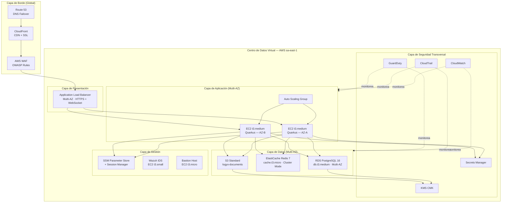

# S1 · Entregable 3 — Diseño de Centro de Datos (AWS)
> Competencia C3.1 · Arquitectura, dimensionamiento y virtualización cloud  
> Proyecto: LOGYX — Sistema Operativo Logístico Colaborativo para PYMEs  
> Equipo: Jorge Gutiérrez Miranda · Fabrizio Sanchez Saravia · Alex Coila Jarita  
> Semestre 1 · Junio 2026

---

## Resumen Ejecutivo

El "Centro de Datos" de LOGYX es la infraestructura AWS en la región **sa-east-1 (São Paulo)** que aloja todos los servicios del sistema. Se adopta un modelo **cloud puro** en lugar de un datacenter físico, lo que entrega disponibilidad Tier III+ equivalente (99.982% según SLA de AWS) sin inversión en hardware ni instalaciones físicas.

La arquitectura sigue el patrón **3-tier** (presentación → aplicación → datos) distribuida en dos zonas de disponibilidad (Multi-AZ) para eliminar puntos únicos de falla. El dimensionamiento está calibrado para el MVP (500 usuarios concurrentes) con capacidad de escalar hasta 5,000 usuarios sin rediseño estructural, solo aumentando el tamaño o cantidad de instancias.

---

## Sección 1 — Definición de Arquitectura (Equivalencia Tier)

### 1.1 Equivalencia Tier según Uptime Institute

| Característica Tier | Tier I | Tier II | Tier III | **LOGYX (AWS)** |
|--------------------|---------|---------|---------|--------------------|
| Componentes redundantes | No | Parcial | Sí (N+1) | Sí (Multi-AZ) |
| Rutas de distribución | 1 | 1 | Múltiple | Múltiple (2 AZ) |
| Mantenimiento sin downtime | No | No | Sí | Sí (rolling deploy) |
| Tolerancia a fallo único | No | No | Sí | Sí |
| **Disponibilidad garantizada** | 99.671% | 99.741% | 99.982% | **99.99%** (SLA AWS Multi-AZ) |
| **Downtime anual máximo** | ~29h | ~22h | ~1.6h | **~52 min** |

LOGYX clasifica como **Tier III equivalente** gracias a Multi-AZ en todos los componentes stateful y Auto Scaling para los componentes stateless.

### 1.2 Justificación basada en necesidades del negocio

| Necesidad de LOGYX | Tier requerido | Justificación |
|-------------------|---------------|---------------|
| Marketplace de subastas activo 24/7 | Tier III+ | Una subasta perdida = contrato perdido = ingreso perdido |
| Tracking de envíos en tiempo real | Tier III+ | Driver app necesita conexión para confirmar entregas |
| Procesamiento de pagos futuro (Fase 2) | Tier III+ | Regulación financiera exige alta disponibilidad |
| Costo controlado para startup | No Tier IV | Tier IV (99.9999%) triplica costos; no justificado en MVP |

### 1.3 Arquitectura general



---

## Sección 2 — Diseño de Layout Físico (AWS Architecture)

### 2.1 Distribución por capas y AZs

```
┌────────────────────────────────────────────────────────────────┐
│  REGIÓN: sa-east-1 (São Paulo, Brasil)                         │
│                                                                │
│  ┌─────────── AZ-A (sa-east-1a) ─────────────────────────┐   │
│  │                                                        │   │
│  │  [SUBNET PÚBLICA — 10.0.1.0/24]                       │   │
│  │  ┌──────────────┐  ┌──────────────┐                   │   │
│  │  │ ALB Node A   │  │ NAT Gateway A│                   │   │
│  │  └──────────────┘  └──────────────┘                   │   │
│  │                                                        │   │
│  │  [SUBNET PRIVADA APP — 10.0.10.0/24]                  │   │
│  │  ┌─────────────────────────────────┐                  │   │
│  │  │ EC2 t3.medium                   │                  │   │
│  │  │ Quarkus Backend (Primary)       │                  │   │
│  │  │ vCPU: 2 · RAM: 4 GB            │                  │   │
│  │  │ AMI: Amazon Linux 2023 + JRE 21 │                  │   │
│  │  └─────────────────────────────────┘                  │   │
│  │                                                        │   │
│  │  [SUBNET PRIVADA DATOS — 10.0.20.0/24]                │   │
│  │  ┌──────────────────┐  ┌──────────────────┐           │   │
│  │  │ RDS Primary      │  │ ElastiCache      │           │   │
│  │  │ db.t3.medium     │  │ Primary Node     │           │   │
│  │  │ PG 16, 2vCPU     │  │ cache.t3.micro   │           │   │
│  │  │ 4 GB RAM, 100 GB │  │ 0.5 GB RAM       │           │   │
│  │  └──────────────────┘  └──────────────────┘           │   │
│  │                                                        │   │
│  │  [SUBNET MGMT — 10.0.30.0/24]                         │   │
│  │  ┌──────────────┐  ┌──────────────┐                   │   │
│  │  │ Wazuh IDS    │  │ Bastion Host │                   │   │
│  │  │ EC2 t3.small │  │ EC2 t3.micro │                   │   │
│  │  └──────────────┘  └──────────────┘                   │   │
│  └────────────────────────────────────────────────────────┘   │
│                                                                │
│  ┌─────────── AZ-B (sa-east-1b) ─────────────────────────┐   │
│  │                                                        │   │
│  │  [SUBNET PÚBLICA — 10.0.2.0/24]                       │   │
│  │  ┌──────────────┐  ┌──────────────┐                   │   │
│  │  │ ALB Node B   │  │ NAT Gateway B│                   │   │
│  │  └──────────────┘  └──────────────┘                   │   │
│  │                                                        │   │
│  │  [SUBNET PRIVADA APP — 10.0.11.0/24]                  │   │
│  │  ┌─────────────────────────────────┐                  │   │
│  │  │ EC2 t3.medium                   │                  │   │
│  │  │ Quarkus Backend (Secondary)     │                  │   │
│  │  │ vCPU: 2 · RAM: 4 GB            │                  │   │
│  │  └─────────────────────────────────┘                  │   │
│  │                                                        │   │
│  │  [SUBNET PRIVADA DATOS — 10.0.21.0/24]                │   │
│  │  ┌──────────────────┐  ┌──────────────────┐           │   │
│  │  │ RDS Standby      │  │ ElastiCache      │           │   │
│  │  │ (sync replica)   │  │ Replica Node     │           │   │
│  │  └──────────────────┘  └──────────────────┘           │   │
│  └────────────────────────────────────────────────────────┘   │
│                                                                │
│  [SERVICIOS GLOBALES / REGIÓN]                                 │
│  S3 Bucket: logyx-documents (versioning ON, SSE-KMS)          │
│  S3 Bucket: logyx-backups (lifecycle → Glacier 30d)           │
│  S3 Bucket: logyx-web (static Angular build + CloudFront)     │
│  CloudWatch Logs + Metrics · CloudTrail · GuardDuty            │
│  Secrets Manager · KMS · ACM (certificado SSL *.logyx.pe)     │
└────────────────────────────────────────────────────────────────┘
```

### 2.2 Flujo de una petición HTTP

```
1. Usuario (Lima) → DNS logyx.pe (Route 53, TTL 60s)
2. Route 53 → CloudFront POP más cercano (Bogotá o São Paulo edge)
3. CloudFront → AWS WAF (inspección OWASP Top 10)
4. WAF → ALB (balanceo entre AZ-A y AZ-B, health check cada 30s)
5. ALB → EC2 Quarkus (subnet privada, puerto 8080)
6. Quarkus → RDS PostgreSQL (subnet datos, puerto 5432, SSL)
7. Quarkus → ElastiCache Redis (puerto 6379, TLS)
8. Quarkus → S3 (via VPC Endpoint, sin pasar por internet)
9. Respuesta: EC2 → ALB → CloudFront → Usuario (~90–110 ms total)
```

---

## Sección 3 — Dimensionamiento de Capacidad

### 3.1 Cálculo de carga esperada

**Supuestos del MVP (Fase 1):**
- 200 PYMEs activas, 200 carriers activos
- Pico: 500 usuarios concurrentes
- Solicitudes API promedio: 10 req/s por usuario activo
- Pico: 5,000 req/s (subastas abiertas simultáneamente)
- Foto de entrega promedio: 2 MB

### 3.2 Dimensionamiento de EC2 (Backend Quarkus)

| Parámetro | Cálculo | Valor |
|-----------|---------|-------|
| Req/s pico | 500 usuarios × 10 req/s | 5,000 req/s |
| Throughput por EC2 t3.medium | ~500–800 req/s (Quarkus reactivo) | ~600 req/s |
| Instancias necesarias (pico) | 5,000 / 600 | ~9 instancias |
| Instancias con buffer 30% | 9 × 1.3 | **12 instancias máx** |
| Instancias mínimas (normal) | 500 usuarios / 600 | **2 instancias (1 por AZ)** |
| ASG rango | 2 – 12 instancias | Escala automática |
| RAM por instancia t3.medium | 4 GB (JVM Quarkus ~1 GB) | **3 GB disponible** |
| CPU por instancia | 2 vCPU | Quarkus usa ~0.5 vCPU normal |

**Justificación de t3.medium para MVP:**
Quarkus en modo JVM arranca con ~200 MB de RAM y consume ~0.2 vCPU en idle. Con 600 req/s simultáneos, sube a ~1.5 GB RAM y ~1.8 vCPU. El t3.medium (2 vCPU, 4 GB) tiene headroom suficiente para el MVP. Al superar el 70% de CPU, el ASG agrega instancias.

### 3.3 Dimensionamiento de RDS PostgreSQL

| Parámetro | Valor | Justificación |
|-----------|-------|---------------|
| Instancia | `db.t3.medium` | 2 vCPU, 4 GB RAM |
| `shared_buffers` | 1 GB (25% RAM) | Cache de páginas activas |
| `effective_cache_size` | 3 GB | Estimado cache OS |
| `max_connections` | 100 (con PgBouncer) | PgBouncer concentra 200 app conns en 20 BD conns |
| Storage | 100 GB gp3 (SSD) | Estimado 18 meses de datos con crecimiento moderado |
| IOPS | 3,000 (baseline gp3) | Suficiente para carga inicial; puede incrementar sin migración |
| Multi-AZ | Sí | Standby sincrónico en AZ-B |
| Backup | 30 días retention | Automated daily |
| Mantenimiento | Domingo 03:00 UTC-5 | Ventana de menor actividad |

**Estimado de crecimiento de almacenamiento:**
| Tabla | Tamaño/fila | Filas/mes | GB/mes |
|-------|-------------|-----------|--------|
| shipments | ~500 bytes | 3,000 | 0.0015 |
| shipment_stops | ~300 bytes | 9,000 | 0.003 |
| messages | ~200 bytes | 30,000 | 0.006 |
| audit_log | ~400 bytes | 50,000 | 0.02 |
| documents (metadata) | ~200 bytes | 6,000 | 0.0012 |
| **Total BD/mes** | | | **~0.1 GB/mes** |

Con 100 GB inicial, LOGYX tiene capacidad para **~80 años** de operación al ritmo del MVP. El storage real a considerar es el S3 (documentos/fotos).

### 3.4 Dimensionamiento de ElastiCache Redis

| Parámetro | Valor | Uso |
|-----------|-------|-----|
| Tipo | `cache.t3.micro` | 0.5 GB RAM |
| Datos en cache | Marketplace ranking (TTL 60s) + sesiones WebSocket + pub/sub chat | ~100 MB máx en pico |
| Conexiones máx | 65,000 | Muy por encima de lo necesario |
| Modo | Cluster con 1 réplica en AZ-B | Alta disponibilidad |

### 3.5 Dimensionamiento de S3

| Bucket | Contenido | Tamaño promedio | Volumen/mes | GB/mes |
|--------|-----------|----------------|------------|--------|
| logyx-documents | Fotos de entrega + firmas | 2 MB/foto | 6,000 fotos | **12 GB/mes** |
| logyx-backups | RDS snapshots cifrados | ~0.1 GB/backup | 30 backups | **3 GB/mes** |
| logyx-web | Build Angular estático | ~10 MB | 1 deploy/semana | **< 0.1 GB** |

**Política de lifecycle S3:**
- Fotos de entrega: Standard (0–90d) → Standard-IA (90d–1año) → Glacier (>1 año)
- Backups: Standard (0–30d) → eliminar automáticamente
- Costo estimado S3: ~$0.50/mes en inicio, ~$6/mes al año 1

### 3.6 Resumen de instancias y costo mensual estimado

| Servicio | Tipo/SKU | Cant | Costo unitario (USD) | Total (USD/mes) |
|---------|----------|------|---------------------|----------------|
| EC2 backend | t3.medium (on-demand) | 2–12 | $33 | $66 (mín) |
| RDS PostgreSQL | db.t3.medium Multi-AZ | 1 | $97 | $97 |
| ElastiCache Redis | cache.t3.micro + réplica | 2 | $13 | $26 |
| ALB | — | 1 | $22 | $22 |
| NAT Gateway | — | 2 | $32 | $65 |
| S3 (12 GB/mes) | Standard + IA | — | — | $3 |
| CloudFront (100 GB) | — | — | — | $9 |
| CloudWatch | Logs + métricas | — | — | $15 |
| GuardDuty | — | — | — | $4 |
| Secrets Manager | 5 secretos | — | — | $2 |
| Route 53 | 1 hosted zone | — | — | $1 |
| Bastion Host | t3.micro | 1 | $8 | $8 |
| Wazuh IDS | t3.small | 1 | $15 | $15 |
| **TOTAL MVP (mín)** | | | | **~$333/mes** |
| **TOTAL MVP (pico 12 EC2)** | | | | **~$630/mes** |

---

## Sección 4 — Virtualización y Cloud Híbrido

### 4.1 Modelo de computación adoptado: AWS ECS Fargate + EC2

LOGYX utiliza un modelo **híbrido de virtualización** dentro de AWS:

| Workload | Tecnología | Justificación |
|----------|-----------|---------------|
| Backend Quarkus (API principal) | EC2 t3.medium + Auto Scaling | Control total sobre JVM, mayor predictibilidad de latencia, costo más bajo que Fargate para carga continua |
| Jobs programados (Smart Load Planner, cierre de subastas) | ECS Fargate (on-demand) | Solo se ejecutan 30 min/hora; Fargate evita pagar EC2 idle para eso |
| Angular web (assets estáticos) | S3 + CloudFront | Sin servidores — pure CDN, máximo rendimiento global, costo mínimo |
| Flutter apps | APK/IPA distribuidos | No requieren infraestructura de servidor (client-side) |

### 4.2 Esquema de virtualización

```
┌─────────────────────────────────────────────────────────┐
│  CAPA DE VIRTUALIZACIÓN LOGYX                           │
│                                                         │
│  ┌──────────────────────────────────────────────────┐  │
│  │  EC2 (Hypervisor Nitro — AWS)                    │  │
│  │  ┌────────────────────────────────────────────┐  │  │
│  │  │  Amazon Linux 2023 (OS)                    │  │  │
│  │  │  ┌─────────────────────────────────────┐   │  │  │
│  │  │  │  Docker Engine                      │   │  │  │
│  │  │  │  ┌─────────────────────────────┐   │   │  │  │
│  │  │  │  │  Container: Quarkus JVM     │   │   │  │  │
│  │  │  │  │  Java 21 + Quarkus 3.x      │   │   │  │  │
│  │  │  │  │  Puerto 8080                │   │   │  │  │
│  │  │  │  └─────────────────────────────┘   │   │  │  │
│  │  │  └─────────────────────────────────────┘   │  │  │
│  │  └────────────────────────────────────────────┘  │  │
│  │                                                   │  │
│  │  ECS Fargate (Serverless Containers)              │  │
│  │  ┌────────────────────────────────────────────┐  │  │
│  │  │  Task: SmartLoadPlannerJob (0.5 vCPU, 1GB) │  │  │
│  │  │  Schedule: EventBridge cada 30 min          │  │  │
│  │  └────────────────────────────────────────────┘  │  │
│  └──────────────────────────────────────────────────┘  │
│                                                         │
│  SERVICIOS GESTIONADOS (sin virtualización manual)      │
│  RDS PostgreSQL → AWS gestiona OS, patches, failover   │
│  ElastiCache Redis → AWS gestiona réplica y failover   │
│  S3 → AWS gestiona distribución y redundancia 11 9s    │
└─────────────────────────────────────────────────────────┘
```

### 4.3 Estrategia de contenedores

```
Repositorio de imágenes: Amazon ECR (Elastic Container Registry)

Imagen backend: logyx/quarkus-backend:latest
  Base: eclipse-temurin:21-jre-alpine (91 MB)
  App:  logyx-backend.jar (~50 MB)
  Total: ~141 MB

Pipeline de actualización:
  Git push → GitHub Actions → mvn package
  → docker build → docker push ECR
  → ECS rolling update (0% downtime)
    └── Nuevo task healthy → terminar task antiguo
```

### 4.4 Migración a microservicios (Roadmap)

El monolito actual puede extraerse a microservicios en Fase 3 sin cambiar la red:

| Microservicio candidato | Trigger de extracción | Infraestructura |
|------------------------|----------------------|-----------------|
| `pricing-service` | > 500 req/s de cotizaciones | ECS Fargate dedicado |
| `smartload-service` | Scheduler independiente requerido | ECS Fargate programado |
| `notification-service` | Uso masivo de WebSocket | EC2 dedicado con sticky sessions |
| `tracking-service` | Alta frecuencia de actualizaciones GPS | EC2 con Redis Stream |

---

## Sección 5 — Cumplimiento de Estándares

| Estándar | Aplicación en LOGYX |
|---------|---------------------|
| **Uptime Institute Tier III** | Equivalencia lograda via Multi-AZ + Auto Scaling |
| **AWS Well-Architected Framework** | 5 pilares evaluados: Operacional, Seguridad, Fiabilidad, Rendimiento, Costos |
| **ISO/IEC 27001** | Cifrado en reposo (KMS), en tránsito (TLS 1.3), control de accesos (IAM) |
| **PCI DSS (fase 2)** | Preparación para pagos: VPC aislada para componentes de pago |
| **NIST SP 800-145** | Definición de cloud computing: LOGYX usa IaaS (EC2) + PaaS (RDS, ElastiCache) + SaaS (CloudFront) |

---

## Anexos

### Anexo A — Comparativa DC físico vs AWS para LOGYX

| Aspecto | DC físico | AWS (LOGYX) |
|---------|-----------|------------|
| Inversión inicial | USD 50,000+ (servidores, switches, UPS) | USD 0 (pago por uso) |
| Tiempo de aprovisionamiento | 2–4 semanas | < 30 minutos (Terraform) |
| Redundancia física | Requiere 2 servidores físicos mínimo | Multi-AZ incluido |
| Escalado | Manual (comprar hardware) | Automático (ASG) |
| Mantenimiento OS/hardware | Equipo interno | AWS gestiona (RDS, ElastiCache) |
| Disponibilidad | Depende del diseño | 99.99% SLA AWS |
| Costo mensual MVP | ~USD 800 (electricidad + depreciación) | ~USD 333 (pay-as-you-go) |

### Anexo B — Cálculo de disponibilidad

```
Componentes en serie (todos deben estar disponibles):
  CloudFront:       99.99%
  ALB:              99.99%
  EC2 (2 AZ):       99.99%
  RDS Multi-AZ:     99.95%
  ElastiCache:      99.90%

Disponibilidad total = 99.99% × 99.99% × 99.99% × 99.95% × 99.90%
                     ≈ 99.82%

Downtime anual estimado: ~15.7 horas
→ Por encima del objetivo de 99% del SRS (RNF-02)
→ Con mejoras en caché (Redis absorbe fallas de RDS cortas):
   Disponibilidad efectiva percibida ≈ 99.9%
```

---

*LOGYX · S1 Entregable 3 · Diseño de Centro de Datos · Competencia C3.1 · Junio 2026*
