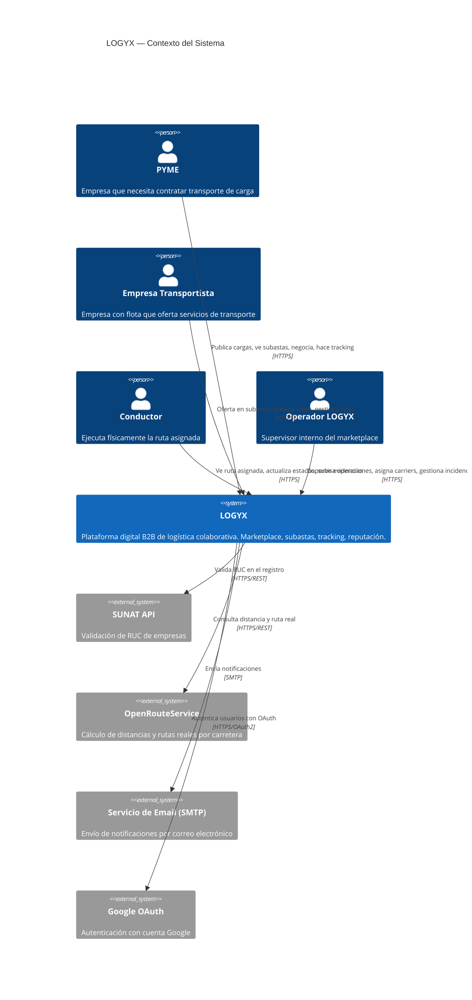
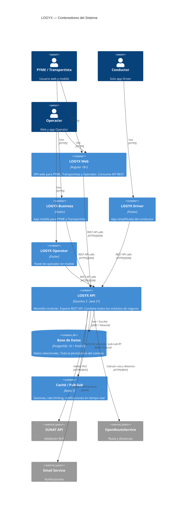
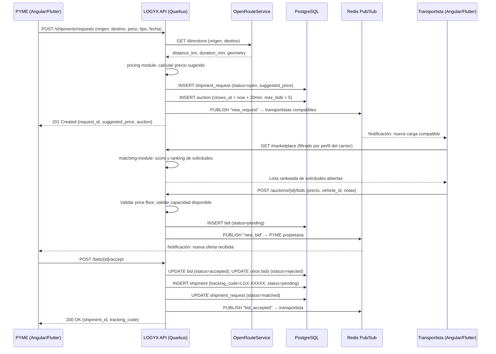
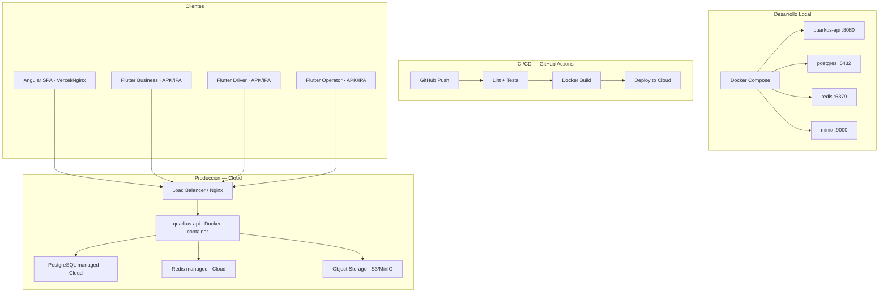

# E1 — Documento de Arquitectura del Sistema
> Estándar: IEEE 42010 + Modelo C4  · Competencia CE0213  
> Proyecto: LOGYX — Sistema Operativo Logístico Colaborativo para PYMEs  
> Equipo: Jorge Gutiérrez Miranda · Fabrizio Sanchez Saravia · Alex Coila Jarita  
> Versión: 1.0 · Junio 2026

---

## 1. Información General

| Campo | Detalle |
|-------|---------|
| **Estilo arquitectónico** | Monolito Modular → Microservicios (evolución planificada) |
| **Estándar de documentación** | IEEE 42010 + Modelo C4 |
| **Backend** | Quarkus 3.x (Java 21) |
| **Frontend Web** | Angular 18+ |
| **Mobile** | Flutter 3.x (3 apps) |
| **Base de datos** | PostgreSQL 16 |
| **Infraestructura** | Docker + Docker Compose (dev) · Cloud (prod) |

---

## 2. Decisiones Arquitectónicas Clave (ADR)

### ADR-01 — Monolito Modular como punto de partida

**Contexto:** El equipo tiene 8 meses y 3 desarrolladores. Un sistema de microservicios desde el inicio implicaría overhead de infraestructura que consumiría tiempo de desarrollo del producto.

**Decisión:** Iniciar con un monolito modular en Quarkus. Cada módulo tiene su propio paquete Java con interfaces públicas bien definidas. Los módulos se comunican internamente sin llamadas de red.

**Consecuencia:** Despliegue simple (un contenedor), desarrollo ágil. Cuando el volumen lo justifique, los módulos de mayor carga (Pricing Engine, Matching Engine) se extraen como servicios independientes sin reescribir la lógica de dominio.

---

### ADR-02 — Quarkus como framework backend

**Contexto:** Se necesita un framework enterprise-grade con soporte para reactive programming, bajo footprint de memoria, y ecosistema robusto para futuros microservicios.

**Decisión:** Quarkus con MutinyIO (reactive), Panache (ORM), RESTEasy Reactive (REST API) y Quarkus Scheduler (jobs).

**Consecuencia:** Compilación nativa con GraalVM disponible para producción. Curva de aprendizaje mayor que Spring Boot, pero superior en alineación con la visión enterprise del sistema.

---

### ADR-03 — Tres aplicaciones Flutter independientes

**Contexto:** Los actores del sistema tienen necesidades radicalmente distintas. Mezclar el panel de la PYME con la app del conductor genera interfaces confusas y flujos innecesariamente complejos.

**Decisión:** Tres apps Flutter separadas que comparten un paquete de dominio compartido:
- **LOGYX Business:** PYME + Empresa Transportista
- **LOGYX Driver:** Conductor (solo ejecución de ruta)
- **LOGYX Operator:** Panel del Operador (versión mobile)

**Consecuencia:** Mayor trabajo de Flutter, pero UX limpia y enfocada por rol.

---

### ADR-04 — PostgreSQL como base de datos única

**Contexto:** El sistema tiene entidades relacionales complejas (envíos, paradas, ofertas, negociaciones) y necesita integridad referencial fuerte.

**Decisión:** PostgreSQL 16 con extensión PostGIS para soporte geoespacial. Redis para caché de sesiones y pub/sub de notificaciones en tiempo real.

**Consecuencia:** Sin base de datos NoSQL adicional en el MVP. Si analytics crece, se evalúa añadir una base columnar (TimescaleDB o ClickHouse) en Fase 2.

---

### ADR-05 — OpenRouteService para cálculo de rutas

**Contexto:** El sistema necesita distancias y rutas reales por carretera (no distancia en línea recta) para el motor de costos y el mapa de tracking.

**Decisión:** OpenRouteService (ORS) en su tier gratuito (~2,000 req/día). La API key vive solo en el backend (nunca en el cliente).

**Consecuencia:** Sin costo en el MVP. Migración a Google Maps Distance Matrix si se requiere mayor precisión o volumen en producción.

---

## 3. Modelo C4

### Nivel 1 — Diagrama de Contexto del Sistema



---

### Nivel 2 — Diagrama de Contenedores



---

### Nivel 3 — Diagrama de Componentes (Quarkus API)

```mermaid
C4Component
  title LOGYX API — Componentes internos (Monolito Modular)

  Container_Boundary(api, "LOGYX API — Quarkus") {
    Component(auth, "auth-module", "Quarkus Security + JWT", "Registro, login, OAuth, validación RUC, RBAC")
    Component(shipment, "shipment-module", "Panache + RESTEasy", "Solicitudes de carga, estados, tracking multi-parada")
    Component(auction, "auction-module", "Quarkus Scheduler", "Subastas inversas, bids, cierre automático, price floor")
    Component(trip, "trip-module", "Panache + RESTEasy", "Viajes publicados por transportistas, reservas de espacio")
    Component(negotiation, "negotiation-module", "WebSocket + Redis Pub/Sub", "Chat por solicitud+carrier, contra-ofertas")
    Component(pricing, "pricing-module", "ORS client + reglas", "Motor de costos, precio sugerido, price floor")
    Component(routing, "routing-module", "ORS client + algoritmos", "Smart Load Planner, matching de retornos, ETA")
    Component(matching, "matching-module", "Score engine", "Ranking y filtrado de cargas por perfil de transportista")
    Component(reputation, "reputation-module", "Bayesian scoring", "Trust Score, reviews, badges")
    Component(fleet, "carrier-module", "Panache", "Flota, vehículos, conductores, capacidad en tiempo real")
    Component(notification, "notification-module", "Redis Pub/Sub + Email", "Notificaciones in-app y email")
    Component(documents, "documents-module", "MinIO/S3 client", "Upload/download de documentos logísticos")
    Component(incident, "incident-module", "Panache", "Incidencias, hilos de comentarios, resolución")
    Component(analytics, "analytics-module", "SQL views", "Dashboards de PYME, Carrier y Operador")
  }

  ContainerDb(db, "PostgreSQL 16", "Base de datos principal")
  Container(cache, "Redis 7", "Caché / Pub-Sub")

  Rel(auth, db, "users, organizations, profiles")
  Rel(shipment, db, "shipment_requests, shipments, shipment_stops")
  Rel(auction, db, "auctions, bids")
  Rel(trip, db, "carrier_trips, trip_bookings")
  Rel(negotiation, db, "messages, counter_offers")
  Rel(negotiation, cache, "Pub/Sub para chat en tiempo real")
  Rel(pricing, db, "pricing_snapshots, cost_calculations")
  Rel(routing, db, "shipment_stops, carrier_trips")
  Rel(reputation, db, "reviews, reputation_scores")
  Rel(fleet, db, "vehicles, drivers")
  Rel(notification, db, "notifications")
  Rel(notification, cache, "Pub/Sub para notificaciones RT")
  Rel(documents, db, "documents")
  Rel(incident, db, "incidents, incident_comments")
  Rel(analytics, db, "Consultas analíticas (read-only)")
```



---

## 4. Flujo de Datos — Flujo Principal (Publicar solicitud → Aceptar oferta)



---

## 5. Estructura de Módulos del Proyecto

```
logyx-backend/                    (Quarkus)
├── src/main/java/com/logyx/
│   ├── auth/
│   │   ├── AuthResource.java      ← endpoints REST
│   │   ├── AuthService.java       ← lógica de negocio
│   │   ├── JwtUtil.java
│   │   └── model/                 ← entidades JPA del módulo
│   ├── shipment/
│   │   ├── ShipmentResource.java
│   │   ├── ShipmentService.java
│   │   ├── AuctionScheduler.java  ← Quarkus Scheduler: cierre automático
│   │   └── model/
│   ├── auction/
│   ├── trip/
│   ├── negotiation/
│   ├── pricing/
│   ├── routing/
│   ├── matching/
│   ├── reputation/
│   ├── carrier/
│   ├── notification/
│   ├── documents/
│   ├── incident/
│   └── analytics/
└── src/main/resources/
    ├── application.properties
    └── db/migration/              ← Flyway migrations

logyx-web/                        (Angular 18+)
├── src/app/
│   ├── core/                     ← guards, interceptors, auth service
│   ├── shared/                   ← componentes reutilizables
│   ├── features/
│   │   ├── auth/
│   │   ├── marketplace/
│   │   ├── shipments/
│   │   ├── fleet/
│   │   ├── reputation/
│   │   ├── operator/
│   │   └── returns/
│   └── layout/

logyx-mobile/                     (Flutter)
├── packages/
│   ├── shared_domain/            ← lógica pura compartida (cálculos, modelos)
│   ├── logyx_business/           ← app PYME + Transportista
│   ├── logyx_driver/             ← app Conductor
│   └── logyx_operator/           ← app Operador
```

---

## 6. Modelo de Despliegue



---

## 7. Seguridad de la Arquitectura

| Capa | Mecanismo |
|------|-----------|
| **Transporte** | HTTPS/TLS 1.3 obligatorio en todos los endpoints |
| **Autenticación** | JWT (access token 1h, refresh token 7 días) + Google OAuth 2.0 |
| **Autorización** | RBAC a nivel de endpoint (`@RolesAllowed`) + filtros de datos a nivel de servicio |
| **Contraseñas** | bcrypt con cost factor 12 |
| **API Keys externas** | Solo en variables de entorno del servidor, nunca expuestas al cliente |
| **Datos sensibles** | RUC/DNI parcialmente ofuscados antes del contrato en respuestas de API |
| **Rate Limiting** | Redis-based rate limiting por IP y por usuario en endpoints de subasta y chat |
| **CORS** | Orígenes permitidos explícitos (dominio de producción y localhost en dev) |
| **SQL Injection** | Prevenido por Panache (ORM con parámetros vinculados) |
| **XSS** | Angular escapa HTML por defecto; CSP headers en el servidor |

---

## 8. Calidad y Estándar ISO/IEC 25010

| Característica | Cómo se aborda en la arquitectura |
|----------------|----------------------------------|
| **Funcionalidad** | Módulos independientes por dominio de negocio, cobertura de todos los RF |
| **Rendimiento** | Reactive programming (MutinyIO), índices PostgreSQL, caché Redis |
| **Compatibilidad** | REST API estándar (JSON), Angular compatible con Chrome/Firefox/Edge, Flutter para Android/iOS |
| **Usabilidad** | Tres apps separadas por actor (UX enfocada), Angular Material |
| **Fiabilidad** | Transacciones ACID en PostgreSQL, manejo de errores centralizado |
| **Seguridad** | JWT + RBAC + HTTPS + bcrypt + rate limiting |
| **Mantenibilidad** | Monolito modular con límites claros, Flyway para migraciones, código documentado |
| **Portabilidad** | Docker containers, variables de entorno para configuración, sin vendor lock-in de infraestructura |

---

*LOGYX · E1 Documento de Arquitectura · IEEE 42010 + C4 · Versión 1.0 · Junio 2026*
