# E1 — Modelado Técnico UML
> Competencia CE0214 · Diagramas estructurales y de comportamiento  
> Proyecto: LOGYX — Sistema Operativo Logístico Colaborativo para PYMEs  
> Equipo: Jorge Gutiérrez Miranda · Fabrizio Sanchez Saravia · Alex Coila Jarita  
> Herramienta: Mermaid (exportar a imagen para entrega formal)  
> Versión: 1.0 · Junio 2026

---

## 1. Diagrama de Casos de Uso

### 1.1 Sistema Completo — Vista General

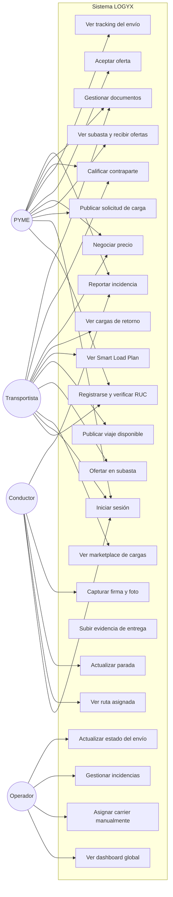

---

### 1.2 Casos de Uso — Módulo Marketplace y Subastas (detalle)

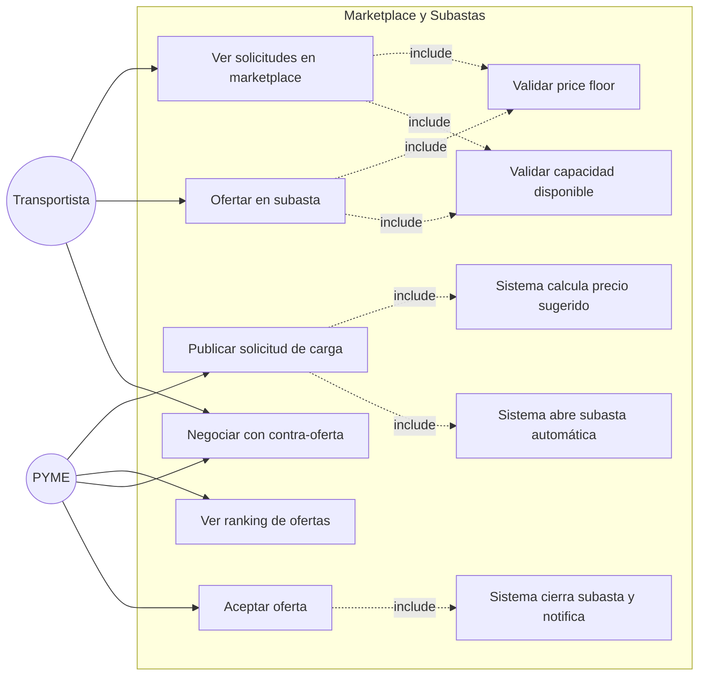

---

### 1.3 Casos de Uso — Módulo Tracking y Driver (detalle)

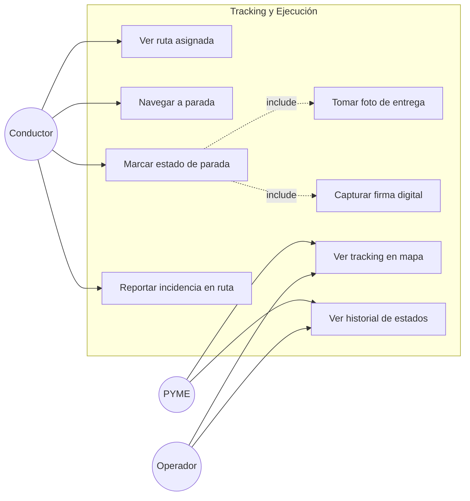

---

## 2. Diagrama de Clases (Alto Nivel)

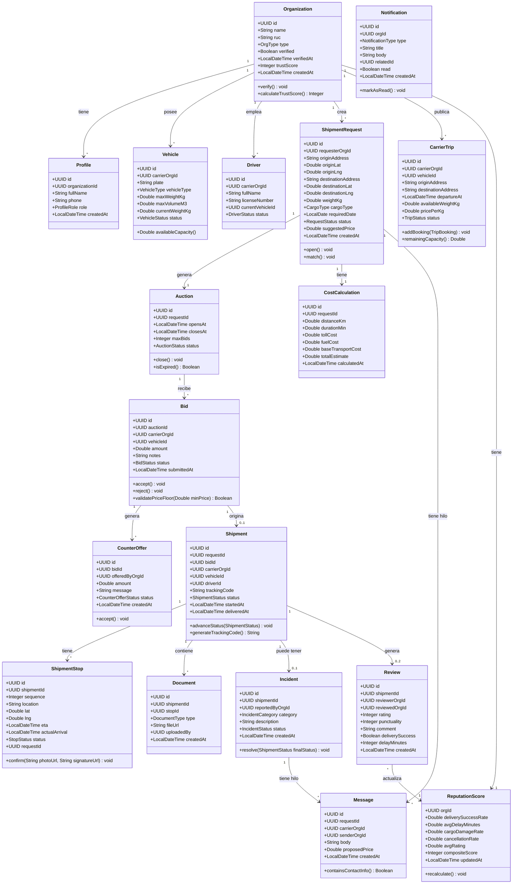

---

## 3. Diagramas de Secuencia

### 3.1 Flujo: PYME publica solicitud y se abre la subasta

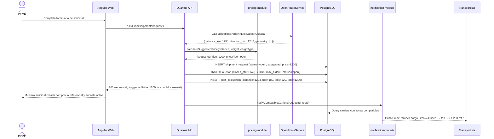

---

### 3.2 Flujo: Transportista oferta y PYME acepta

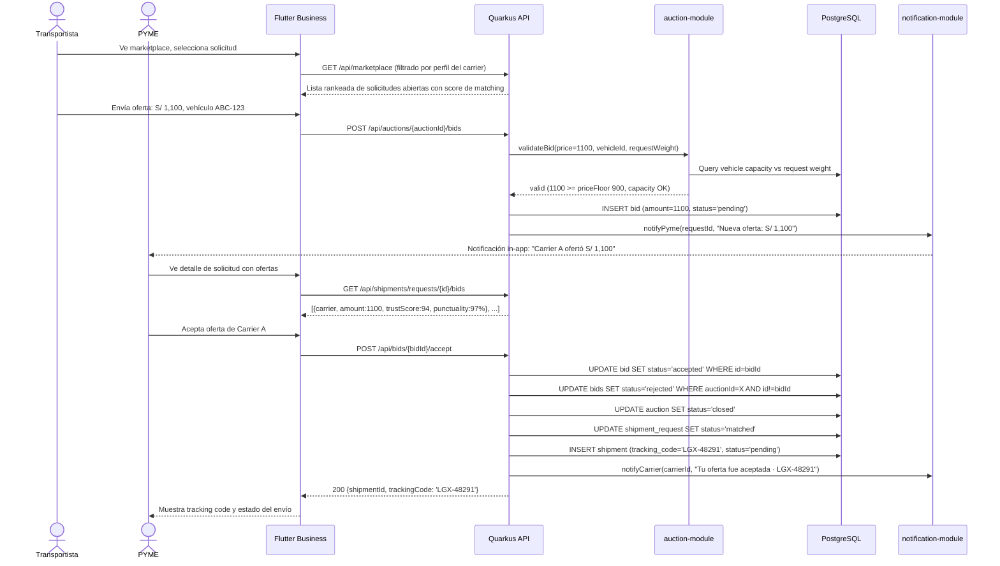

---

### 3.3 Flujo: Conductor actualiza estado de parada

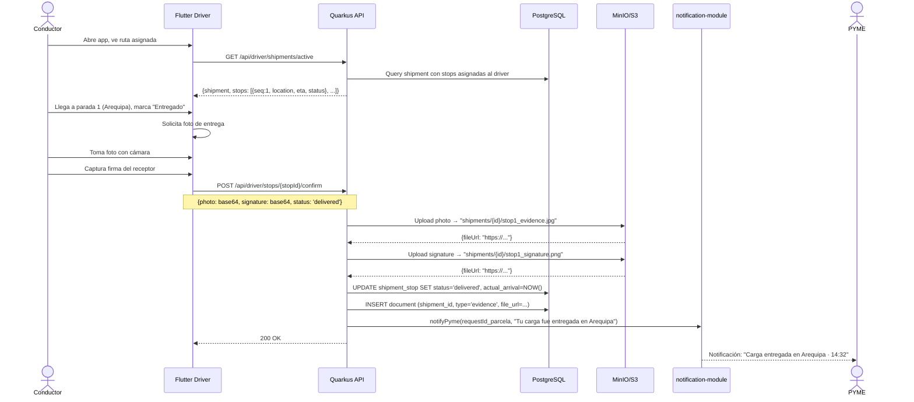

---

### 3.4 Flujo: Negociación bidireccional con contra-oferta

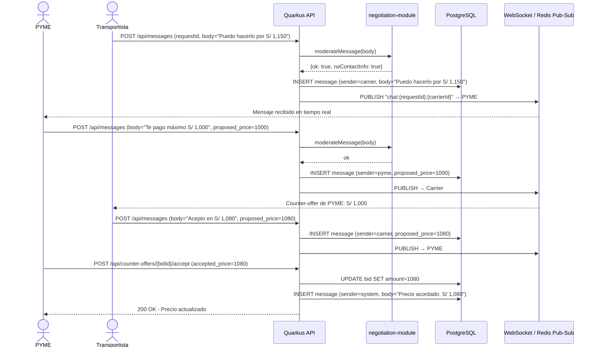

---

### 3.5 Flujo: Smart Load Planner sugiere combinación de cargas

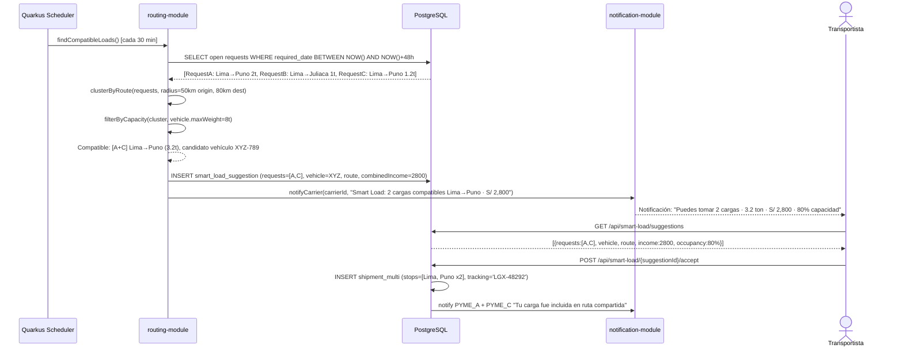

---

## 4. Diagrama de Estados — Ciclo de Vida del Envío

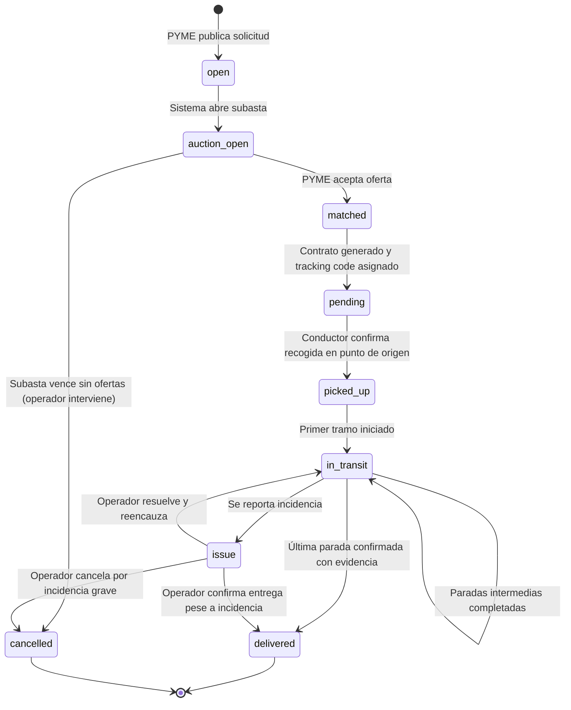

---

## 5. Diagrama de Componentes — Aplicación Angular

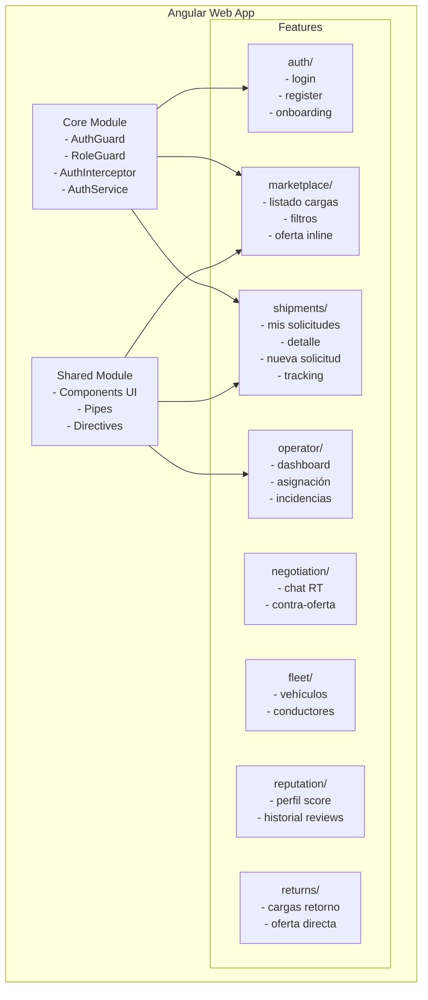

---

*LOGYX · E1 Modelado Técnico UML · Competencia CE0214 · Versión 1.0 · Junio 2026*
